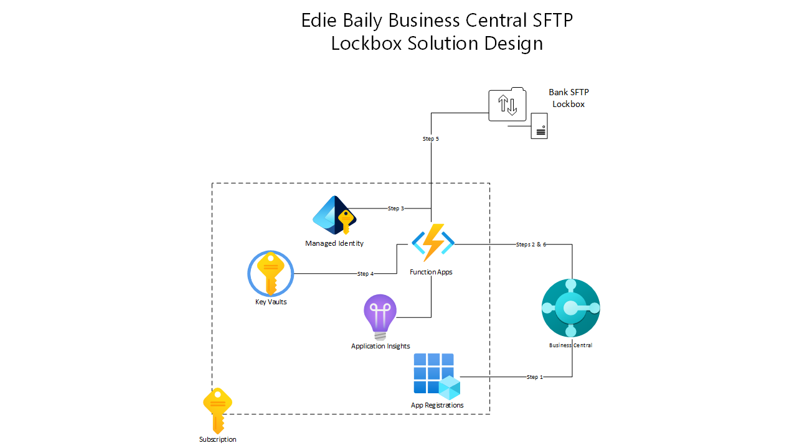

# Eide Bailly SFTP Lockbox Function Documentation

Thank you for your interest in the Eide Bailly SFTP Lockbox Function.  This Azure Fuction app will assist developers in your organization in connecting to a finanical insituation's lockbox SFTP site.  Currently, the solution only supports authentication via a user name and x509 certificate.  These credentials, along with the URL for the lockbox site, are securely stored in an Azure Key Vault which is deployed along with the function in the same resource group.  This function is NOT intended to stand alone, rather it should be used with another consuming application.  In the future Eide Bailly intends to release an AppSource App for integrating lockbox transactions with Microsoft Dynamics Bunsiness Central and this function will be required for that application's communication with the lockbox service.

## Overview
The function app provides developers with three functions:
1. GetIpAddress
   - GET: 
   - Returns the static IP address of the function app which is configured during deployment.  This can be useful if you need to supply the function's IP address to your insitution for whitelisting on their firewall / server.

2. GetFileList
   - POST: { "Path": "path to your files from the root of the server" }
   - Returns a Json Array of Json serialized .NET File Objects.  The Path attribute can be passed to the GetFile function in order to retrieve the file's contents.

3. GetFile
   - POST: { "Path": "full path to your file" }
   - Returns the contents of the file at the supplied FULL path as a Json object.  Each line in the file can be parsed according to the BIA 2 specification.
   - Supplying "testFile" as the Path parameter will return a sample file's contents.  This can be useful while developing your file parsing logic if your institions archieves or deletes files after they are read from the server.

## Documentaiton

1. [Azure Deployment](docs/deployment/AzureDeployment.md)
2. [Configuration](docs/configuration/AzureConfiguration.md)
3. [Troubleshooting](docs/troubleshooting/Troubleshooting.md)

## Reference Architecture

The following diagram provides a reference architecture for consuming this funcation application from within Microsoft Dynamics Business Central, as an example.

