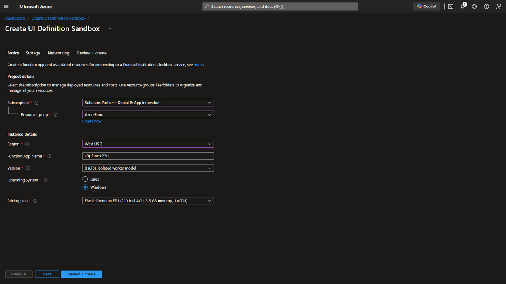

# Azure Deployment steps

## 1. Basics Step

In this step, the basic deployment parameters are supplied for an Azure Function App.  This app requires a premium SKU, due to the requirement for a static IP address for whitelisting.
