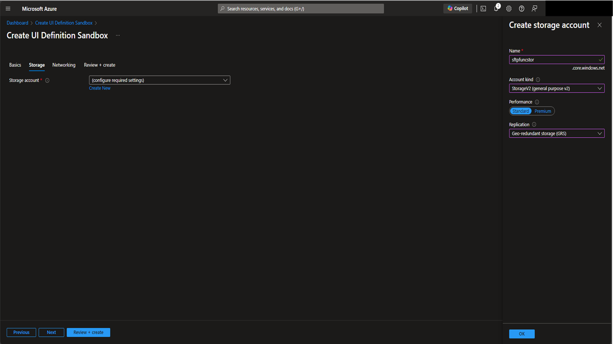
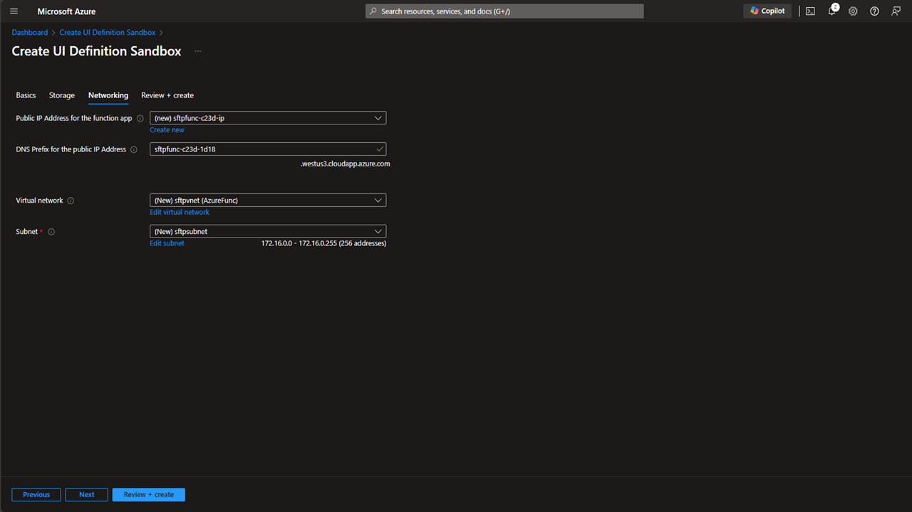
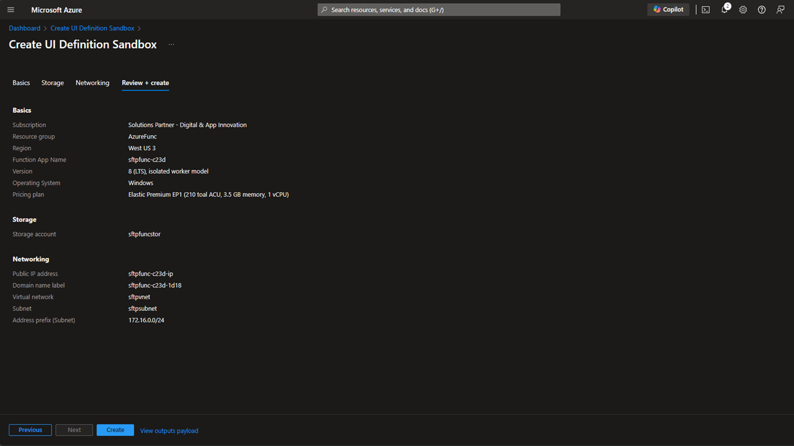

# Azure Deployment steps

## 1. Basics Step

In this step, the basic deployment parameters are supplied for an Azure Function App.  This app requires a premium SKU, due to the requirement for a static IP address for whitelisting.

## 2. Networking Step

In this step, you can configure your preferred storage account settings for the function app.  This storage account is ONLY for the function app's storage requirements.  The lockbox files are NOT ever storaged in this location, or any other locations.

## 3. Networking Step

In this step, you can configure your preffered networking settings for the function app.

## 4. Review and Create step

This is the final step.  After clicking the Create button the application will deploy into your choosen subscription.

Now you are ready to move onto the configuration process, outlined [here](../configuration/AzureConfiguration.md).